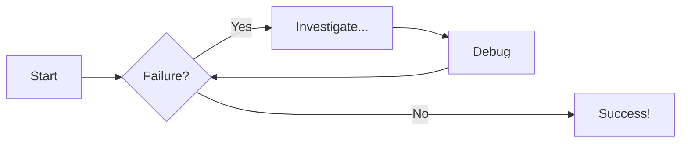
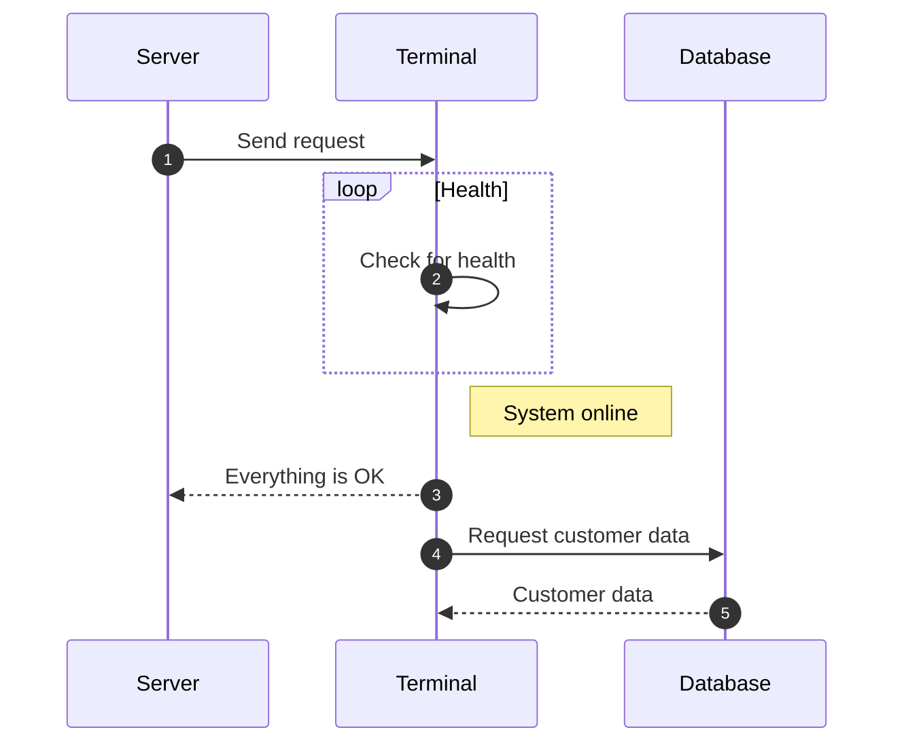

---
date:
  created: 2025-12-20
  updated: 2025-12-23

draft: True

tags:
  - diagrams
  - mermaid
  - markdown

links:
  - blog/posts/2025-12-22__01_life_satisfaction/index.md
  - Also see:
    - NY Times: https://nytimes.com

---

# Test Post

A playground to explore various features and workflows for writing blog posts.

<!-- more -->

1. Each post is it's own folder with a naming pattern `YYYY-MM-DD_NUM_TEXT`

2. All assets (like images) per post should go into the same folder.


/// caption
A Mountain
///

## Links

I like to create a new tab when a user clicks on a link.

[Click here to open Google](https://google.com){: target="_blank" }

## A table with a caption

Fruit      | Amount
---------- | ------
Apple      | 20
Peach      | 10
Banana     | 3
Watermelon | 1

/// caption
Fruit Count
///

## Some code

Here is an example of Python code.

```py title="add_numbers.py" linenums="1"
# Function to add two numbers
def add_two_numbers(num1, num2):
    return num1 + num2

# Example usage
result = add_two_numbers(5, 3)
print('The sum is:', result)
```

## Diagram Examples

### Flowcharts



<!-- more -->

## Sequence Diagrams

