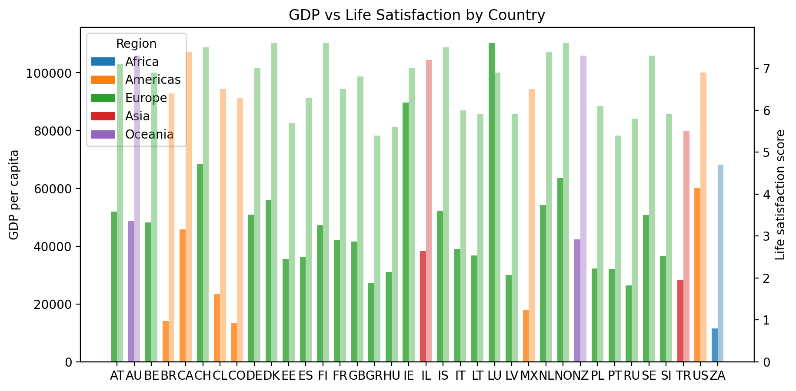
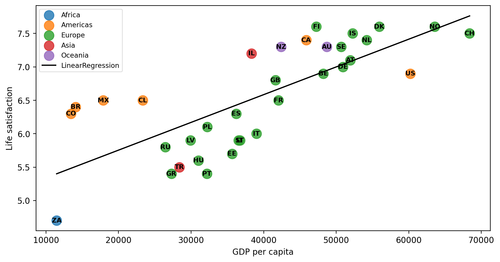

---
date:
  created: 2025-12-22
  updated: 2024-12-22

draft: True

categories:
  - Regression

tags:
  - python
---

# An exploration into Life Satisfaction based on a country's GDP

## Data

Using a toy dataset from [Aurélien Géron's Github repo](https://raw.githubusercontent.com/ageron/data/refs/heads/main/lifesat/lifesat_full.csv).

<!-- more -->

There are only 35 countries with their GDP and life satisfaction score. 


/// caption
GDP (left side) and Life Satisfaction (right side)
///

`Please note` that this data is very outdated and most likely not correct anymore. For example [Germany's GDP](https://en.wikipedia.org/wiki/Germany) is not `$50,922` but it is estimated to be `$73,553` in 2025.

I have add two new columns to the dataset representing the `continent` and the 2-letter country code. This can be easily achieved with a small python module called
[countryinfo](https://github.com/porimol/countryinfo).

There are two "outliers" that can be noticed visually. Both of their bars are almost the same size. `Luxembourg` is an obvious candidate for high life satisfaction and high GDP.
But `Ireland` I find a bit surprising at first but there are [economical reasons](https://en.wikipedia.org/wiki/Republic_of_Ireland#Economy).

Let's see the data in a scatter plot including the linear regression line.


/// caption
GDP (x axis) and Life Satisfaction (y axis)
///

Here the outliers are even more pronounced.

## Regression Model

Let's do a simple [linear regression](https://scikit-learn.org/stable/modules/generated/sklearn.linear_model.LinearRegression.html) to create a model.

As an error metric I use the simple `Mean Absolute Error`. 

```py
def make_model(df):
    X = df[['gdp']].values # shape (n, 1)
    y = df['score'].values # shape (n,)

    print(f"X is {X.shape[0]} GDP samples")
    print(f"y is {y.shape[0]} scores")

    model = LinearRegression()
    model.fit(X, y)

    print(f"Intercept: {model.intercept_:.4f}")
    print(f"Coef (slope): {model.coef_[0]:.8f}")

    y_pred = model.predict(X)
    # mae = np.mean(np.abs(y - y_pred))
    mae = mean_absolute_error(y, y_pred)

    baseline = np.full_like(y, y.mean())
    baseline_mae = mean_absolute_error(y, baseline)

    print(f"Baseline MAE: {baseline_mae:.3f}")
    print(f"MAE / baseline: {mae / baseline_mae:.3f}")

    return model

model = make_model(df)
```

Output:
```
X is 36 GDP samples
y is 36 scores
Intercept: 5.5802
Coef (slope): 0.00002334
Baseline MAE: 0.664
MAE / baseline: 0.822
```

When removing the two outliers the output becomes:

```py
df_filtered = df[~df["country_code"].isin(["LU", "IE"])]
model = make_model(df_filtered)
```

```
X is 34 GDP samples
y is 34 scores
Intercept: 4.9248
Coef (slope): 0.00004148
Baseline MAE: 0.680
MAE / baseline: 0.654
```

The slope is very shallow because the values on the x-axis are much larger than on the y-axis.


