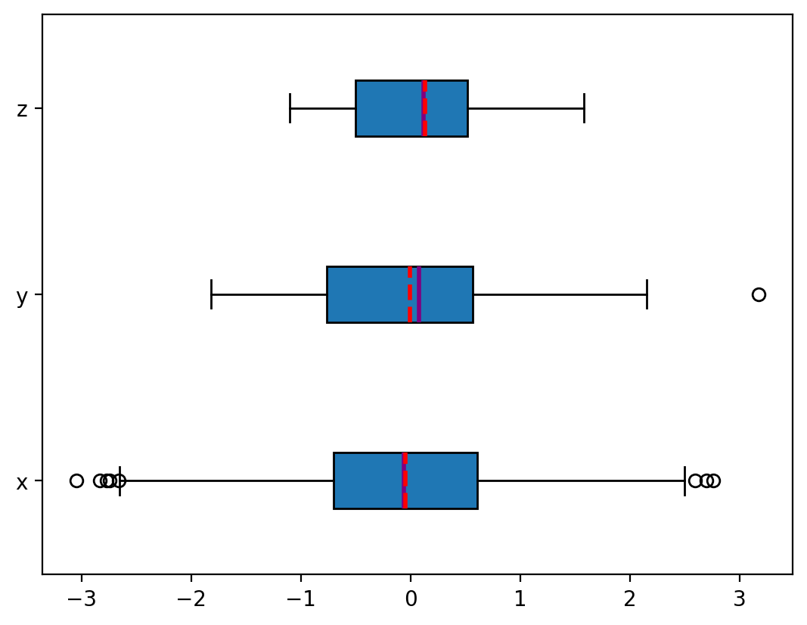
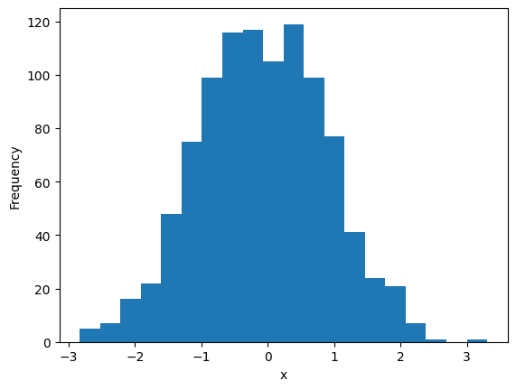
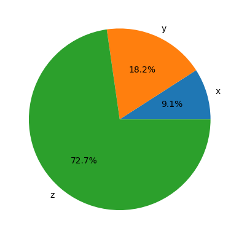
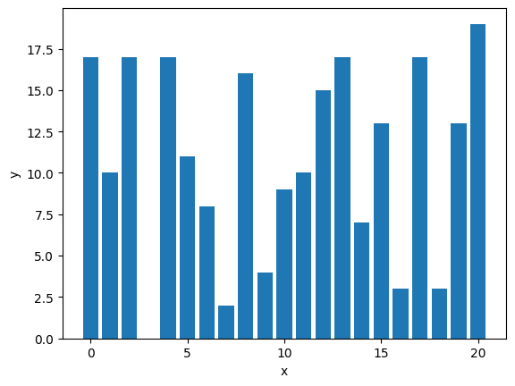
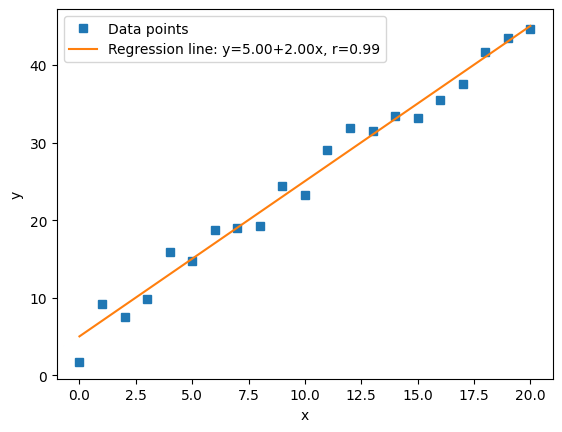
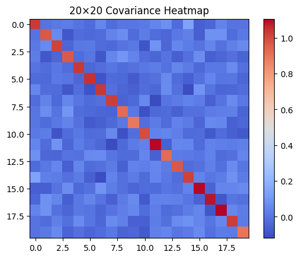
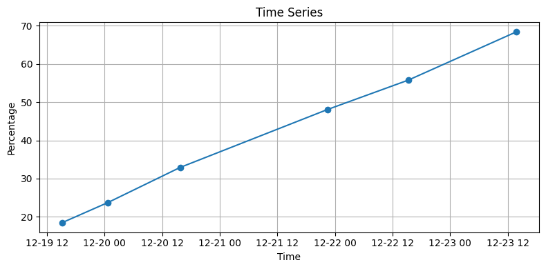

---
date:
  created: 2025-12-22
  updated: 2025-12-22

draft: False

categories:
  - Visualization

tags:
  - python
  - matplotlib
  - cheat sheet

links:
  - matplotlib cheat sheet: https://matplotlib.org/cheatsheets/
  - Nicolas P. Rougier matplotlib tutorial: https://github.com/rougier/matplotlib-tutorial
  - matplotlib plot types: https://matplotlib.org/stable/plot_types/index
  - Scientific Visualization - Python + Matplotlib book: https://github.com/rougier/scientific-visualization-book 
---


# matplotlib cheat sheet

You haven't touched `matplotlib` for awhile and feeling a bit rusty?

Here you go!

<!-- more -->

## Various Visualization Type

### Box Plot

The box plot is an excellent tool to visually represent descriptive statistics of a given dataset.
It can show the range, interquartile range (IQR), median, mode, outliers, and all quartiles.


```py
np.random.seed(seed=0)
x = np.random.randn(1000)
y = np.random.randn(100)
z = np.random.randn(10)

fig, ax = plt.subplots()
ax.boxplot((x, y, z),
  vert=False,
  showmeans=True,
  meanline=True,
  tick_labels=('x', 'y', 'z'),
  patch_artist=True,
  medianprops={'linewidth': 2, 'color': 'purple'},
  meanprops={'linewidth': 2, 'color': 'red'})

plt.show()
```

The black line is called "whiskers". It is defined a q1 - k*IQR to the left. Where k is
1.5 by default. The right it's `q3 + k * IQR`. All points outside the whisker are considered outliers.

- The mean is the dashed red line.
- The median is the purple blue line.
- The first quartile is the left edge of the blue rectangle.
- The third quartile is the right edge of the blue rectangle.
- The interquartile range is the length of the blue rectangle.
- The range contains everything from left to right.
- The outliers are the dots to the left and right.


/// caption
A box plot
///

### Histogram

Define a bunch of bins and add elements to it.


```py
x = np.random.randn(1000)
hist, bin_edges = np.histogram(x, bins=20)

fig, ax = plt.subplots()
ax.hist(x, bin_edges, cumulative=False)
ax.set_xlabel('x')
ax.set_ylabel('Frequency')

plt.savefig(blog_post_path+"histogram", bbox_inches="tight", dpi=200)
plt.show()

print(bin_edges)
```

You can almost see the [bell curve](https://en.wikipedia.org/wiki/Normal_distribution).


/// caption
A histogram plot
///

### Pie Chart

```py
x, y, z = 128, 256, 1024
fig, ax = plt.subplots()
ax.pie((x, y, z), labels=('x', 'y', 'z'), autopct='%1.1f%%')

plt.show()
```


/// caption
A pie chart
///

### Bar chart

```py
x = np.arange(21)
y = np.random.randint(21, size=21)

_, ax = plt.subplots()
ax.bar(x, y)
ax.set_xlabel('x')
ax.set_ylabel('y')

plt.show()
```


/// caption
A bar chart
///

### X-Y (scatter) plot

```py
x = np.arange(21)
y = 5 + 2 * x + 2 * np.random.randn(21)
slope, intercept, r, *__ = stats.linregress(x, y)
line = f'Regression line: y={intercept:.2f}+{slope:.2f}x, r={r:.2f}'

fig, ax = plt.subplots()
ax.plot(x, y, linewidth=0, marker='s', label='Data points')
ax.plot(x, intercept + slope * x, label=line)
ax.set_xlabel('x')
ax.set_ylabel('y')
ax.legend(facecolor='white')

plt.savefig(blog_post_path+"scatter_plot", bbox_inches="tight", dpi=100)
plt.show()
```


/// caption
A scatter plot.
///

### Heat Map

```py
np.random.seed(42)

data = np.random.randn(500, 20)
matrix = np.cov(data, rowvar=False)

fig, ax = plt.subplots()
im = ax.imshow(matrix, cmap="coolwarm")
plt.colorbar(im, ax=ax)
plt.title("20×20 Covariance Heatmap")

plt.savefig(blog_post_path+"heat_map", bbox_inches="tight", dpi=100)
plt.show()
```


/// caption
A heat map.
///

### Time Series

```py
data = [
    ("18.46%", "2025-12-19 15:09:03.820743+00"),
    ("23.76%", "2025-12-20 00:44:20.406011+00"),
    ("32.92%", "2025-12-20 15:44:12.245323+00"),
    ("48.07%", "2025-12-21 22:23:57.511577+00"),
    ("55.79%", "2025-12-22 15:16:56.125265+00"),
    ("68.42%", "2025-12-23 13:47:07.883421+00"),
]

df = pd.DataFrame(data, columns=["value", "timestamp"])
df["value"] = df["value"].str.rstrip("%").astype(float)
df["timestamp"] = pd.to_datetime(df["timestamp"])

plt.figure(figsize=(8, 4))
plt.plot(df["timestamp"], df["value"], marker="o")
plt.xlabel("Time")
plt.ylabel("Percentage")
plt.title("Time Series")
plt.grid(True)
plt.tight_layout()
plt.show()
```


/// caption
Plotting a time series.
///
