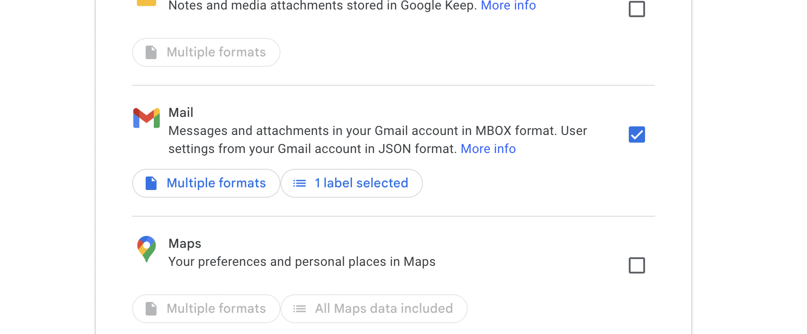
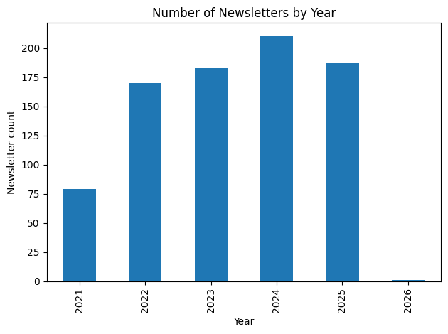

---
date:
  created: 2026-01-02
  updated: 2026-01-05

draft: True

tags:
  - nlp
  - money stuff
  - gmail export

links:
  - Money Stuff: https://www.bloomberg.com/account/newsletters/money-stuff
  - Money Stuff Podcast: https://www.bloomberg.com/podcasts/series/money-stuff
  - Google Takeout: https://takeout.google.com/
---

# Money Stuff - Part 1

This is part 1 of my investigation of the [Money Stuff](https://www.bloomberg.com/account/newsletters/money-stuff){: target="_blank" } newsletter by [Matt Levine](https://en.wikipedia.org/wiki/Matt_Levine_(columnist)){: target="_blank" }.

Part 1 just downloads the emails from my inbox and does a simple parsing into a pandas dataframe.

<!-- more -->

The Money Stuff newsletter is a newsletter about current financial STUFF (as Matt like to say.) He is very good at laying out financial news into easy
digestible pieces for non-financial people like me. It is very entertaining! I can also highly recommend the accompanying [Podcast](https://www.bloomberg.com/podcasts/series/money-stuff){: target="_blank" }.

There is a lot of information in each of the newsletter and so I thought I can make this into an interested series of blog posts.

In the first one I will lay out how to build the database and then scrape the information.

## Export Emails with Google Takeout

I receive the newsletter via email and label

1. Go to [Google Takeout](https://takeout.google.com/)

1. `Deselect All` - We only want to export emails with a specific label.

1. Look further down for `Mail` and select that option.

1. Click on `All Mail data included`. Deselect `Include all messages in Mail` and also deselect all other labels by clicking twice on `Select All`.

1. Scroll down to the label (`Money Stuff` in my case) and select.



6. Scroll all the way down and click on `Next Step`.

7. Click on `Create Export`.

Once you kicked off the process you should receive an email after a few minutes (or hours). But at some point you will get an email with link to
download the export as a zip file.


## Parsing the data

Loading the emails with Python is surprisingly simple because Python comes with a `mailbox` and `email` modules. As a first pass we just
extract the newsletter subject, sent_datetime, and the html. The html will later be parsed into the data model.

```py
from email.header import decode_header
from email.utils import parsedate_to_datetime
import mailbox

def decode_subject(subject):
    if "" in subject:
        decoded_parts = decode_header(subject)
        return "".join(
            part.decode(encoding or "utf-8") if isinstance(part, bytes) else part
            for part, encoding in decoded_parts
        )

    return subject

def get_html(msg):
    if msg.is_multipart():
        for part in msg.walk():
            # print(part.get_content_type())
            if part.get_content_type() == "text/html":
                return part.get_payload(decode=True).decode(errors="ignore")

    raise Exception("No html found")

def load_newsletters_from_mbox(mbox_fn: str) -> list[dict]:
    mbox = mailbox.mbox(mbox_fn)
    
    messages = []
    for n, msg in enumerate(mbox):
        subject = decode_subject(msg["subject"])
        sent_datetime = parsedate_to_datetime(msg["date"])
        html = get_html(msg)

        messages.append({
            "subject": subject,
            "sent_datetime": sent_datetime,
            "html": html,
        })

    return messages


fn = "$PWD/Money Stuff.mbox"
newsletters = load_newsletters_from_mbox(fn)
```

Next is to load the data into a panda's dataframe to examine what we have and to also clean up the timestamps.

```py
import pandas as pd

df = pd.DataFrame(newsletters, columns=["subject", "sent_datetime"])
print(len(df))
```

Turns out there 831 newsletters.

### Clean the sent timestamps

There is a bit of timezone shenanigans going on with the timestamps. We are mixing various timezones as the following codes shows:

```py
df["sent_datetime"].apply(
    lambda x: getattr(x, "tzinfo", None)
).value_counts(dropna=False)
```

```
sent_datetime
UTC-04:00    366
UTC          274
UTC-05:00    189
UTC+02:00      2
Name: count, dtype: int64
```

But pandas flexibility can fix this fairly easily:

```py
# utc=True - forces all offsets into a single UTC timeline
df["sent_datetime"] = (
    pd.to_datetime(df["sent_datetime"], errors="raise", utc=True)
)
```

### Some basic stats

As mentioned above there are 831 messages. The first one is from `2021-01-01` and the last one is from `2026-01-02` (this will change of course).

The distribution of newsletters per years looks like this:

```py
import matplotlib.pyplot as plt

counts_by_year = (
    df
    .set_index("sent_datetime")
    .resample("YE")
    .size()
)

ax = counts_by_year.plot(kind="bar")
ax.set_xticks(range(len(counts_by_year)))
ax.set_xticklabels(counts_by_year.index.year)

plt.xlabel("Year")
plt.ylabel("Newsletter count")
plt.title("Number of Newsletters by Year")
plt.tight_layout()
plt.show()
```


/// caption
Number of Newsletter by Year.
///


There should be many more newsletters from previous years. So, you have them in your email inbox I would be very delighted to get my hands on them.
Please message me via `diedatenschleuder` @ `gmail.com`

## Part 2

In the next part we will parse the data into a data model and load the data into a sqlite database. We will also enable FTS (full text search).

I will also explore how Gemini CLI can put together some interesting sql queries.

By then I should also have the Github repo up.


